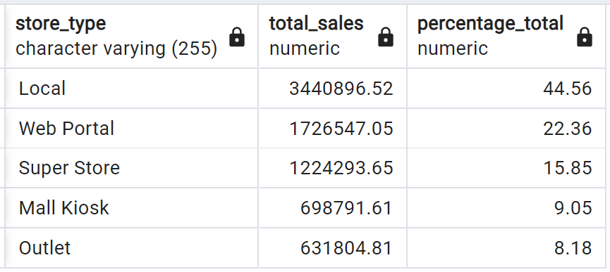

## SQL Query Results From Postgres

### Task 1: How many stores does the business have and in which counties?

### Task 2: Which locations currently have the most stores?

### Task 3: Which months produce the average highest cost of sales typically?

### Task 4: How many sales are coming from online? 

### Task 5: What percentages of sale come through each type of store?

### Task 6: Which month in each year produced the highest cost of sales?

### Task 7: What is our staff headcount?

### Task 8: Which German store type is selling the most?

### Task 9: How quickly is the company making sales?
